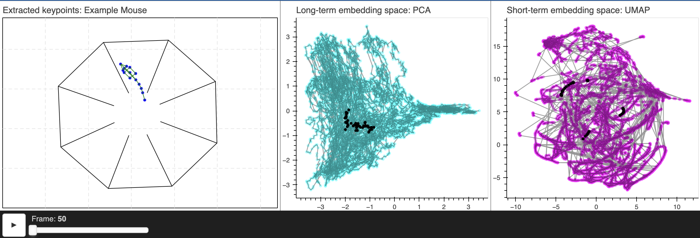

# [BAMS](https://multiscale-behavior.github.io/) Interactive Visualization Tool
Interactive visualization tool developed for use with [BAMS](https://multiscale-behavior.github.io/).



## Overview
This repo contains the code necessary to generate interactive visualizations, which allow you to see your keypoint data and embeddings evolve in real time. Additionally, we include an example notebook, ```example.ipynb```, which illustrates how to use the tool on a small sample dataset from Dr. Chris Rodgers' lab. See [Mai, Jessica et. al.](https://www.biorxiv.org/content/10.1101/2024.01.08.574475v1.abstract) 

## Setup
Clone this repository:
```bash
git clone https://github.com/nerdslab/bams_interactive_vis.git
```
Setup a virtual environment and install dependencies.
```
python3 -m venv bams_vis_env
source bams_vis_env/bin/activate
pip install --upgrade pip
pip install -r requirements.txt
```

To use the environment in a jupyter notebook. Make sure to select bams_vis_env as your jupyter kernel.
```
python3 -m ipykernel install --name=bams_vis_env --user
```
## Generating Visualizations
For an in-depth example see ```example.ipynb```. We reccomend walking through this notebook before deploying this tool in your own code.

To deploy this visualization in your own jupyter notebook, clone this repo into your workspace and run:
```
from bams_interactive_vis.interactive_visualization import generate_visualization
generate_visualization(keypoints, short_term_reps, long_term_reps)
```
**Note:** This function must be run inside of a jupyter noteboook.

## Citation
If you find the dataset and/or code useful for your research, please consider citing our work:
```
@article{azabou2024relax,
  title={Relax, it doesn’t matter how you get there: A new self-supervised approach for multi-timescale behavior analysis},
  author={Azabou, Mehdi and Mendelson, Michael and Ahad, Nauman and Sorokin, Maks and Thakoor, Shantanu and Urzay, Carolina and Dyer, Eva},
  journal={Advances in Neural Information Processing Systems},
  volume={36},
  year={2024}
}
 ```
We would like to thank Dr. Chris Rodgers for providing data for this tool. If you use find this data useful for your research, please consider citing:
```
@article{mai2024sound,
  title={Sound-seeking before and after hearing loss in mice},
  author={Mai, Jessica and Gargiullo, Rowan and Zheng, Megan and Esho, Valentina and Hussein, Osama E and Pollay, Eliana and Bowe, Cedric and Williamson, Lucas M and McElroy, Abigail F and Goolsby, William N and others},
  journal={bioRxiv},
  pages={2024--01},
  year={2024},
  publisher={Cold Spring Harbor Laboratory}
}
 ```